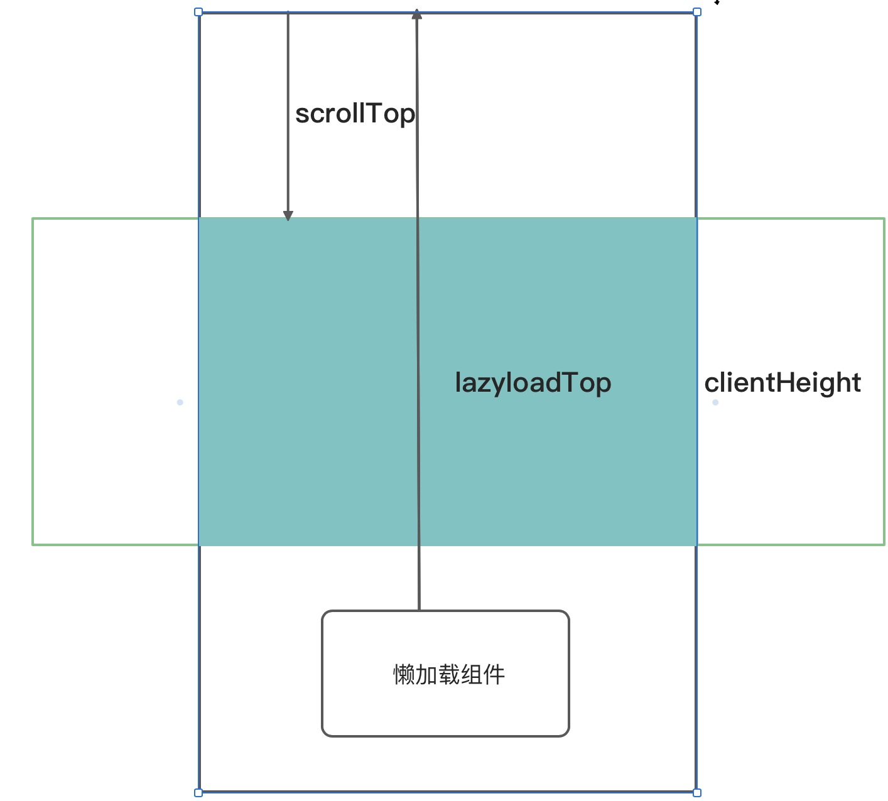

# 概念

> 懒加载其实就是延时加载，即当对象需要用到的时候再去加载。<br />

# 必要性

## 一、用户流失率（用户体验）

> 以APP为例，研究发现如果的APP打开的响应速度超过5s，用户大概率会离开这个APP，意味着如果你的竞争对手比你快一秒或者2秒，你的客户就会离你远去了。

## 二、耗费带宽资源

> 试想一下一个电商商城类型的网站，首页图片一般会非常多，如果用户每次访问首页，会请求大量的图片，而用户并不会全部浏览完，会耗费非常多的带宽/流量，运营成本也会相应的增加。

# 区别于路由懒加载

> 我们这里只考虑组件懒加载，不考虑路由懒加载，路由懒加载实际上是借用es6 的 import + webpack打包实现的

# 懒加载前置知识



1. lazyloadTop：需要懒加载的元素达到内容顶部的距离。

2. clientHeight/offsetHeight：中间蓝色区域为网页可视区域，即我们肉眼可以看到的区域，clientHeight/offsetHeight具体区别可以自行百度搜索。

3. scrollTop:对象最顶端和窗口中可见内容的最顶端之间的距离，即为滚动条滚动距离。

>懒加载即监听浏览器滚动事件，一开始通过一些方法不进行正常的渲染加载，当需要懒加载的组件进入视图时，即lazyloadTop<=scrollTop+clientHeight时，进行一些加载操作。

# IntersectionObserver API

> 网页开发时，常常需要了解某个元素是否进入了"视口"（viewport），即用户能不能看到它。

> 传统的实现方法是，监听到scroll事件后，调用目标元素（绿色方块）的getBoundingClientRect()方法，得到它对应于视口左上角的坐标，再判断是否在视口之内。这种方法的缺点是，由于scroll事件密集发生，计算量很大，容易造成性能问题。

> 目前有一个新的 IntersectionObserver API，可以自动"观察"元素是否可见，Chrome 51+ 已经支持。由于可见（visible）的本质是，目标元素与视口产生一个交叉区，所以这个 API 叫做"交叉观察器"。更多的属性以及使用方法可以参考阮一峰的这个[blob](https://www.ruanyifeng.com/blog/2016/11/intersectionobserver_api.html)写的非常好。

# 图片懒加载

## 1.将src替代为更小的base64图片代替（后发现浏览器限制无法解析故换成http协议图片）

> 页面中的img，如果没有src属性或者不是一个http链接的地址，浏览器就不会发出请求去下载图片，一旦通过JS设置了src，浏览器才会送请求下载图片并显示。

## 2.使用data-src替代

> 我们要在一开始的时候将保存到一个属性中去，方便后续我们进行设置，当然也可以将保存到state中，但是存在局限性。

```js
//核心代码
//图片刚加载到页面时
if(!prevVisible && !visible){
    if(isImg(childrenProp)){
        setChildren(React.cloneElement(childrenProp,{src:DEFAULT_URL,datasrc:childrenProp.props.src}))
    } 
//当图片进入视图时
}else if(!prevVisible && visible){
    if(isImg(childrenProp)){
        setChildren(React.cloneElement(prevChildren,{src:prevChildren.props.datasrc}))
    } 
}
```
# 背景图片懒加载

原理和图片懒加载并无区别，主要是将src属性变为乐 style中的backgroundImage或者background属性。

```js
//核心代码
 if(!prevVisible && !visible){
        ......
                setChildren(React.cloneElement(childrenProp,{
                    style:{
                        ...childrenProp.props.style, 
                        [hasAttribute(childrenProp)]:`url(${DEFAULT_URL})`
                    },
                    datasrc:childrenProp.props.style[hasAttribute(childrenProp)]})
                )}
        //当图片进入视图时
        }else if(!prevVisible && visible){
        ......
                setChildren(React.cloneElement(prevChildren,{
                    style:{
                        ...childrenProp.props.style, 
                        [hasAttribute(childrenProp)]:prevChildren.props.datasrc
                    },
                }))
            }
} 
```

# 组件懒加载

当组件并不是img标签或者并无background-color时，自动判断为组件懒加载，如果是组件懒加载，直接在达到视图的时候将其显示即可。

```js
//核心代码
//图片刚加载到页面时
        if(!prevVisible && !visible){
            ......
        //当图片进入视图时
        }else if(!prevVisible && visible){
            if(isImg(childrenProp)){
                ...
            } else if(isBackgroundImg(childrenProp)){ 
                ...
            }else{
                setChildren(childrenProp)
            }
        } 
```

# （开源）开源这个组件

该[组件](https://github.com/parrot-design/parrot-rc-lazyload/blob/main/dist/parrotreactlazyload.esm.js)打包后仅4kb大小,核心代码不到20行，阅读起来非常简单，代码里面采用了新的API并加入了proyfill，并没有采用传统的监听滚动+节流，已经发布到github上面。

```js
//使用方式
npm install -S @parrotjs/react-lazyload

import LazyLoad from '@parrotjs/react-lazyload'

const url = 'https://img2.baidu.com/it/u=881124525,886726031&fm=15&fmt=auto&gp=0.jpg';

//图片
<LazyLoad>
    
</LazyLoad>

//背景图片
<LazyLoad>
    <div style={{backgroundImage:url}}/>
</LazyLoad>

//组件会自动识别是否存在背景图
<LazyLoad>
    <div style={{background:url}}/>
</LazyLoad>

//组件
<LazyLoad>
    <div>我在视口才会显示</div>
</LazyLoad>

```

# API

目前只开放了placeholder这个api 可以自己提供组件为加载时的占位符 未来会开放更多的api

# Github地址

地址在[这里](https://github.com/parrot-design/parrot-rc-lazyload)，欢迎大家使用并star，有项目上的需求可以提出来，我会完善组件。

